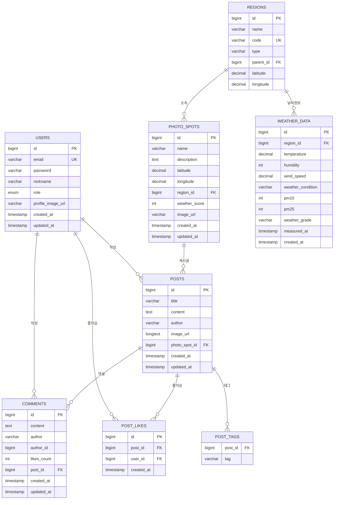

# 📸 WebForPhoto - 포토스팟 공유 플랫폼

포토스팟을 찾고, 공유하고, 날씨 정보를 확인할 수 있는 웹 애플리케이션입니다.

## 🚀 기술 스택

### Frontend
- **React 18** - 사용자 인터페이스
- **TypeScript** - 타입 안전성
- **Vite** - 빠른 개발 환경
- **Tailwind CSS** - 스타일링
- **React Router DOM** - 라우팅
- **Axios** - HTTP 클라이언트

### Backend
- **Spring Boot 3.5.4** - 웹 프레임워크
- **Java 17** - 백엔드 언어
- **Spring Data JPA** - 데이터베이스 ORM
- **MySQL 8.0** - 관계형 데이터베이스
- **Spring Security** - 인증 및 보안
- **JWT (jjwt 0.11.5)** - 토큰 기반 인증
- **Gradle** - 빌드 도구

### DevOps & Tools
- **Docker** - 컨테이너화
- **Docker Compose** - 다중 컨테이너 관리
- **Git** - 버전 관리

## 📊 데이터베이스 스키마 (ERD)



## 📡 API 명세서

### 🔐 인증 API

| Method | Endpoint | Description | Request Body | Response |
|--------|----------|-------------|--------------|----------|
| POST | `/api/auth/login` | 로그인 | `{email, password}` | `{token, user}` |
| POST | `/api/auth/signup` | 회원가입 | `{email, password, nickname}` | `{message}` |
| PUT | `/api/auth/profile-image` | 프로필 이미지 업데이트 | `{imageUrl}` | `{user}` |

### 🌤️ 날씨 API

| Method | Endpoint | Description | Parameters | Response |
|--------|----------|-------------|------------|----------|
| GET | `/api/weather/map` | 전국 날씨 지도 데이터 | - | `Map<String, WeatherDto>` |
| GET | `/api/weather/grade/{regionCode}` | 지역별 상세 날씨 정보 | `regionCode` | `WeatherDto` |
| GET | `/api/weather/district/{districtCode}` | 시군구별 날씨 정보 | `districtCode` | `WeatherDto` |

### 📍 포토스팟 API

| Method | Endpoint | Description | Parameters | Response |
|--------|----------|-------------|------------|----------|
| GET | `/api/photospots` | 전체 포토스팟 목록 | - | `List<PhotoSpotDto>` |
| GET | `/api/photospots/{spotId}` | 특정 포토스팟 상세 | `spotId` | `PhotoSpotDto` |
| GET | `/api/photospots/region/{regionId}` | 지역별 포토스팟 | `regionId` | `List<PhotoSpotDto>` |
| GET | `/api/photospots/region/code/{regionCode}` | 지역코드별 포토스팟 | `regionCode` | `List<PhotoSpotDto>` |
| GET | `/api/photospots/best` | 베스트 포토스팟 | `limit` | `List<PhotoSpotDto>` |
| POST | `/api/photospots` | 포토스팟 생성 | `PhotoSpotDto` | `PhotoSpotDto` |

### 📝 게시글 API

| Method | Endpoint | Description | Parameters | Response |
|--------|----------|-------------|------------|----------|
| GET | `/api/posts` | 전체 게시글 목록 | - | `List<PostDto>` |
| GET | `/api/posts/{postId}` | 특정 게시글 상세 | `postId` | `PostDto` |
| GET | `/api/posts/spot/{spotId}/latest` | 포토스팟별 최신 게시글 | `spotId` | `List<PostDto>` |
| GET | `/api/posts/spot/{spotId}/best` | 포토스팟별 베스트 게시글 | `spotId` | `List<PostDto>` |
| POST | `/api/posts` | 게시글 작성 | `CreatePostRequest` | `PostDto` |
| POST | `/api/posts/{postId}/like` | 게시글 좋아요 | `postId, userId` | `PostDto` |
| GET | `/api/posts/best` | 베스트 게시글 | `limit` | `List<PostDto>` |

### 💬 댓글 API

| Method | Endpoint | Description | Parameters | Response |
|--------|----------|-------------|------------|----------|
| GET | `/api/comments/post/{postId}` | 게시글별 댓글 목록 | `postId` | `List<CommentDto>` |
| POST | `/api/comments` | 댓글 작성 | `CreateCommentRequest` | `CommentDto` |
| DELETE | `/api/comments/{commentId}` | 댓글 삭제 | `commentId, userId` | `{message}` |
| POST | `/api/comments/{commentId}/like` | 댓글 좋아요 | `commentId` | `CommentDto` |

### 🗺️ 지역 API

| Method | Endpoint | Description | Parameters | Response |
|--------|----------|-------------|------------|----------|
| GET | `/api/regions` | 전체 지역 목록 | - | `List<RegionDto>` |
| GET | `/api/regions/{id}` | 특정 지역 정보 | `id` | `RegionDto` |
| GET | `/api/regions/code/{code}` | 지역코드별 정보 | `code` | `RegionDto` |

## 🌟 주요 기능

### 📍 포토스팟 관리
- **포토스팟 검색**: 지역별 포토스팟 조회
- **포토스팟 상세**: 위치, 설명, 이미지 확인
- **포토스팟 등록**: 새로운 포토스팟 추가

### 📝 게시글 시스템
- **글 작성**: 포토스팟별 게시글 작성
- **이미지 업로드**: 최대 10MB 이미지 지원
- **태그 시스템**: 게시글 태그 기능
- **좋아요 기능**: 게시글 좋아요/취소

### 🌤️ 날씨 정보
- **실시간 날씨**: 기상청 API 연동
- **미세먼지 정보**: 환경공단 API 연동
- **날씨 점수**: 포토스팟별 날씨 등급
- **지역별 날씨**: 전국 17개 시도 날씨

### 👤 사용자 관리
- **회원가입/로그인**: JWT 기반 인증
- **프로필 관리**: 사용자 정보 관리
- **마이페이지**: 개인 활동 내역

### 🗺️ 지도 기능
- **네이버 지도**: 포토스팟 위치 표시
- **지역 선택**: 시도/시군구 선택
- **반응형 지도**: 모바일 친화적 UI

## 🛠️ 설치 및 실행

### 1. 프로젝트 클론
```bash
git clone <repository-url>
cd Renew_WebForPhoto-main
```

### 2. 데이터베이스 설정
```sql
# MySQL 접속
mysql -u root -p

# 데이터베이스 생성
CREATE DATABASE WFP CHARACTER SET utf8mb4 COLLATE utf8mb4_unicode_ci;
```

### 3. 백엔드 실행
```bash
# 프로젝트 루트 디렉토리에서
./gradlew bootRun
```

백엔드는 `http://localhost:8080`에서 실행됩니다.

### 4. 프론트엔드 실행
```bash
# frontend 디렉토리로 이동
cd frontend

# 의존성 설치
npm install

# 개발 서버 실행
npm run dev
```

프론트엔드는 `http://localhost:5173`에서 실행됩니다.

### 5. Docker로 실행 (선택사항)
```bash
# Docker Compose로 전체 서비스 실행
docker-compose -f docker-compose.local.yml up -d
```

## 🔧 환경 설정

### 데이터베이스 설정
```properties
# application.properties
spring.datasource.url=jdbc:mysql://localhost:3306/WFP
spring.datasource.username=root
spring.datasource.password=1234
```

### API 키 설정
```properties
# 네이버 지도 API
naver.client.id=your-naver-client-id
naver.client.secret=your-naver-client-secret

# 기상청 API
weather.api.key=your-weather-api-key

# 환경공단 API
air.api.key=your-air-quality-api-key
```

## 📁 프로젝트 구조

```
Renew_WebForPhoto-main/
├── frontend/                 # React 프론트엔드
│   ├── src/
│   │   ├── components/      # 재사용 가능한 컴포넌트
│   │   ├── pages/          # 페이지 컴포넌트
│   │   ├── services/       # API 서비스
│   │   ├── types/          # TypeScript 타입 정의
│   │   ├── utils/          # 유틸리티 함수
│   │   └── context/        # React Context
│   ├── public/             # 정적 파일
│   └── package.json
├── src/main/java/backend/WebFroPhto/
│   ├── config/             # 설정 클래스
│   ├── controller/         # REST API 컨트롤러
│   ├── service/           # 비즈니스 로직
│   ├── repository/        # 데이터 접근 계층
│   ├── entity/           # JPA 엔티티
│   └── dto/              # 데이터 전송 객체
├── src/main/resources/    # 설정 파일
├── docs/                 # 프로젝트 문서
├── docker-compose.local.yml
└── build.gradle
```

## 🐛 문제 해결

### 일반적인 문제들

#### 1. 포트 충돌
```bash
# 포트 확인
lsof -ti:8080
lsof -ti:5173

# 프로세스 종료
kill -9 <process-id>
```

#### 2. 데이터베이스 연결 오류
```bash
# MySQL 상태 확인
brew services list | grep mysql

# MySQL 재시작
brew services restart mysql
```

#### 3. 이미지 업로드 오류
- 이미지 크기: 최대 10MB
- 지원 형식: PNG, JPG, GIF
- Base64 변환: 자동 처리

## 📈 성능 최적화

### 프론트엔드
- **이미지 최적화**: WebP 형식 지원
- **코드 스플리팅**: React.lazy 사용
- **캐싱**: 브라우저 캐시 활용

### 백엔드
- **데이터베이스 인덱싱**: 쿼리 성능 최적화
- **API 캐싱**: Redis 캐시 적용
- **이미지 압축**: Base64 데이터 최적화

## 🚀 배포

### 프로덕션 환경 준비사항
- **Database**: MySQL 8.0
- **API Keys**: 기상청, 환경공단 API 키 설정
- **CORS**: 실제 도메인 설정
- **SSL**: HTTPS 인증서 설정

### 배포 옵션
1. **Vercel + Railway**: 빠른 배포
2. **AWS/GCP/Azure**: 클라우드 서비스
3. **Docker + 클라우드**: 컨테이너 배포

## 🤝 기여하기

1. Fork the Project
2. Create your Feature Branch (`git checkout -b feature/AmazingFeature`)
3. Commit your Changes (`git commit -m 'Add some AmazingFeature'`)
4. Push to the Branch (`git push origin feature/AmazingFeature`)
5. Open a Pull Request

## 📄 라이선스

이 프로젝트는 MIT 라이선스 하에 배포됩니다. 자세한 내용은 `LICENSE` 파일을 참조하세요.

## 📞 문의

프로젝트에 대한 문의사항이 있으시면 이슈를 생성해 주세요.

---

**WebForPhoto** - 포토스팟을 더욱 특별하게 만들어주는 플랫폼 📸✨ 