# 📸 WebForPhoto - 포토스팟 공유 플랫폼

포토스팟을 찾고, 공유하고, 날씨 정보를 확인할 수 있는 웹 애플리케이션입니다.

| **Frontend** |     |
| **Backend** |  |
|------|------|


## 🚀 기술 스택

| 분류 | 기술 | 로고 | 설명 |
|------|------|------|------|
| **Frontend** |  | React 18 | 사용자 인터페이스 |
| |  | TypeScript | 타입 안전성 |
| |  | Vite | 빠른 개발 환경 |
| |  | Tailwind CSS | 스타일링 |
| |  | React Router DOM | 라우팅 |
| |  | Axios | HTTP 클라이언트 |
| **Backend** |  | Spring Boot 3.5.4 | 웹 프레임워크 |
| |  | Java 17 | 백엔드 언어 |
| |  | Spring Data JPA | 데이터베이스 ORM |
| |  | MySQL 8.0 | 관계형 데이터베이스 |
| |  | Spring Security | 인증 및 보안 |
| |  | JWT (jjwt 0.11.5) | 토큰 기반 인증 |
| |  | Gradle | 빌드 도구 |
| **DevOps & Tools** |  | Docker | 컨테이너화 |
| |  | Docker Compose | 다중 컨테이너 관리 |
| |  | Git | 버전 관리 |

## 📊 데이터베이스 스키마 (ERD)



```mermaid
erDiagram
    USERS {
        bigint id PK
        varchar email UK
        varchar password
        varchar nickname
        enum role
        varchar profile_image_url
        timestamp created_at
        timestamp updated_at
    }

    REGIONS {
        bigint id PK
        varchar name
        varchar code UK
        varchar type
        bigint parent_id FK
        decimal latitude
        decimal longitude
    }

    PHOTO_SPOTS {
        bigint id PK
        varchar name
        text description
        decimal latitude
        decimal longitude
        bigint region_id FK
        int weather_score
        varchar image_url
        timestamp created_at
        timestamp updated_at
    }

    POSTS {
        bigint id PK
        varchar title
        text content
        varchar author
        longtext image_url
        bigint photo_spot_id FK
        timestamp created_at
        timestamp updated_at
    }

    COMMENTS {
        bigint id PK
        text content
        varchar author
        bigint author_id
        int likes_count
        bigint post_id FK
        timestamp created_at
        timestamp updated_at
    }

    POST_LIKES {
        bigint id PK
        bigint post_id FK
        bigint user_id FK
        timestamp created_at
    }

    WEATHER_DATA {
        bigint id PK
        bigint region_id FK
        decimal temperature
        int humidity
        decimal wind_speed
        varchar weather_condition
        int pm10
        int pm25
        varchar weather_grade
        timestamp measured_at
        timestamp created_at
    }

    POST_TAGS {
        bigint post_id FK
        varchar tag
    }

    USERS ||--o{ POSTS : "ì‘성"
    USERS ||--o{ COMMENTS : "ì‘성"
    USERS ||--o{ POST_LIKES : "좋아요"
    REGIONS ||--o{ PHOTO_SPOTS : "소ì†"
    REGIONS ||--o{ WEATHER_DATA : "날씨정보"
    PHOTO_SPOTS ||--o{ POSTS : "게시글"
    POSTS ||--o{ COMMENTS : "댓글"
    POSTS ||--o{ POST_LIKES : "좋아요"
    POSTS ||--o{ POST_TAGS : "태그"
```

## 📡 API 명세서

### 🔐 인증 API

| Method | Endpoint | Description | Request Body | Response |
|--------|----------|-------------|--------------|----------|
| POST | `/api/auth/login` | 로그인 | `{email, password}` | `{token, user}` |
| POST | `/api/auth/signup` | 회원가입 | `{email, password, nickname}` | `{message}` |
| PUT | `/api/auth/profile-image` | 프로필 이미지 업데이트 | `{imageUrl}` | `{user}` |

### 🌤️ 날씨 API

| Method | Endpoint | Description | Parameters | Response |
|--------|----------|-------------|------------|----------|
| GET | `/api/weather/map` | 전국 날씨 지도 데이터 | - | `Map<String, WeatherDto>` |
| GET | `/api/weather/grade/{regionCode}` | 지역별 상세 날씨 정보 | `regionCode` | `WeatherDto` |
| GET | `/api/weather/district/{districtCode}` | 시군구별 날씨 정보 | `districtCode` | `WeatherDto` |

### 📍 포토스팟 API

| Method | Endpoint | Description | Parameters | Response |
|--------|----------|-------------|------------|----------|
| GET | `/api/photospots` | 전체 포토스팟 목록 | - | `List<PhotoSpotDto>` |
| GET | `/api/photospots/{spotId}` | 특정 포토스팟 상세 | `spotId` | `PhotoSpotDto` |
| GET | `/api/photospots/region/{regionId}` | 지역별 포토스팟 | `regionId` | `List<PhotoSpotDto>` |
| GET | `/api/photospots/region/code/{regionCode}` | 지역코드별 포토스팟 | `regionCode` | `List<PhotoSpotDto>` |
| GET | `/api/photospots/best` | 베스트 포토스팟 | `limit` | `List<PhotoSpotDto>` |
| POST | `/api/photospots` | 포토스팟 생성 | `PhotoSpotDto` | `PhotoSpotDto` |

### 📝 게시글 API

| Method | Endpoint | Description | Parameters | Response |
|--------|----------|-------------|------------|----------|
| GET | `/api/posts` | 전체 게시글 목록 | - | `List<PostDto>` |
| GET | `/api/posts/{postId}` | 특정 게시글 상세 | `postId` | `PostDto` |
| GET | `/api/posts/spot/{spotId}/latest` | 포토스팟별 최신 게시글 | `spotId` | `List<PostDto>` |
| GET | `/api/posts/spot/{spotId}/best` | 포토스팟별 베스트 게시글 | `spotId` | `List<PostDto>` |
| POST | `/api/posts` | 게시글 작성 | `CreatePostRequest` | `PostDto` |
| POST | `/api/posts/{postId}/like` | 게시글 좋아요 | `postId, userId` | `PostDto` |
| GET | `/api/posts/best` | 베스트 게시글 | `limit` | `List<PostDto>` |

### 💬 댓글 API

| Method | Endpoint | Description | Parameters | Response |
|--------|----------|-------------|------------|----------|
| GET | `/api/comments/post/{postId}` | 게시글별 댓글 목록 | `postId` | `List<CommentDto>` |
| POST | `/api/comments` | 댓글 작성 | `CreateCommentRequest` | `CommentDto` |
| DELETE | `/api/comments/{commentId}` | 댓글 삭제 | `commentId, userId` | `{message}` |
| POST | `/api/comments/{commentId}/like` | 댓글 좋아요 | `commentId` | `CommentDto` |

### 🗺️ 지역 API

| Method | Endpoint | Description | Parameters | Response |
|--------|----------|-------------|------------|----------|
| GET | `/api/regions` | 전체 지역 목록 | - | `List<RegionDto>` |
| GET | `/api/regions/{id}` | 특정 지역 정보 | `id` | `RegionDto` |
| GET | `/api/regions/code/{code}` | 지역코드별 정보 | `code` | `RegionDto` |

## 🌟 주요 기능

### 📍 포토스팟 관리
- **포토스팟 검색**: 지역별 포토스팟 조회
- **포토스팟 상세**: 위치, 설명, 이미지 확인
- **포토스팟 등록**: 새로운 포토스팟 추가

### 📝 게시글 시스템
- **글 작성**: 포토스팟별 게시글 작성
- **이미지 업로드**: 최대 10MB 이미지 지원
- **태그 시스템**: 게시글 태그 기능
- **좋아요 기능**: 게시글 좋아요/취소

### 🌤️ 날씨 정보
- **실시간 날씨**: 기상청 API 연동
- **미세먼지 정보**: 환경공단 API 연동
- **날씨 점수**: 포토스팟별 날씨 등급
- **지역별 날씨**: 전국 17개 시도 날씨

### 👤 사용자 관리
- **회원가입/로그인**: JWT 기반 인증
- **프로필 관리**: 사용자 정보 관리
- **마이페이지**: 개인 활동 내역

### 🗺️ 지도 기능
- **네이버 지도**: 포토스팟 위치 표시
- **지역 선택**: 시도/시군구 선택
- **반응형 지도**: 모바일 친화적 UI

## 🛠️ 설치 및 실행

### 1. 프로젝트 클론
```bash
git clone <repository-url>
cd Renew_WebForPhoto-main
```

### 2. 데이터베이스 설정
```sql
# MySQL 접속
mysql -u root -p

# 데이터베이스 생성
CREATE DATABASE WFP CHARACTER SET utf8mb4 COLLATE utf8mb4_unicode_ci;
```

### 3. 백엔드 실행
```bash
# 프로젝트 루트 디렉토리에서
./gradlew bootRun
```

백엔드는 `http://localhost:8080`에서 실행됩니다.

### 4. 프론트엔드 실행
```bash
# frontend 디렉토리로 이동
cd frontend

# 의존성 설치
npm install

# 개발 서버 실행
npm run dev
```

프론트엔드는 `http://localhost:5173`에서 실행됩니다.

### 5. Docker로 실행 (선택사항)
```bash
# Docker Compose로 전체 서비스 실행
docker-compose -f docker-compose.local.yml up -d
```

## 🔧 환경 설정

### 데이터베이스 설정
```properties
# application.properties
spring.datasource.url=jdbc:mysql://localhost:3306/WFP
spring.datasource.username=root
spring.datasource.password=1234
```

### API 키 설정
```properties
# 네이버 지도 API
naver.client.id=your-naver-client-id
naver.client.secret=your-naver-client-secret

# 기상청 API
weather.api.key=your-weather-api-key

# 환경공단 API
air.api.key=your-air-quality-api-key
```

## 📁 프로젝트 구조

```
Renew_WebForPhoto-main/
├── frontend/                 # React 프론트엔드
│   ├── src/
│   │   ├── components/      # 재사용 가능한 컴포넌트
│   │   ├── pages/          # 페이지 컴포넌트
│   │   ├── services/       # API 서비스
│   │   ├── types/          # TypeScript 타입 정의
│   │   ├── utils/          # 유틸리티 함수
│   │   └── context/        # React Context
│   ├── public/             # 정적 파일
│   └── package.json
├── src/main/java/backend/WebFroPhto/
│   ├── config/             # 설정 클래스
│   ├── controller/         # REST API 컨트롤러
│   ├── service/           # 비즈니스 로직
│   ├── repository/        # 데이터 접근 계층
│   ├── entity/           # JPA 엔티티
│   └── dto/              # 데이터 전송 객체
├── src/main/resources/    # 설정 파일
├── docs/                 # 프로젝트 문서
├── docker-compose.local.yml
└── build.gradle
```
