# 🎨 WebForPhoto 프론트엔드 컴포넌트 다이어그램

## 🏗️ React 컴포넌트 아키텍처

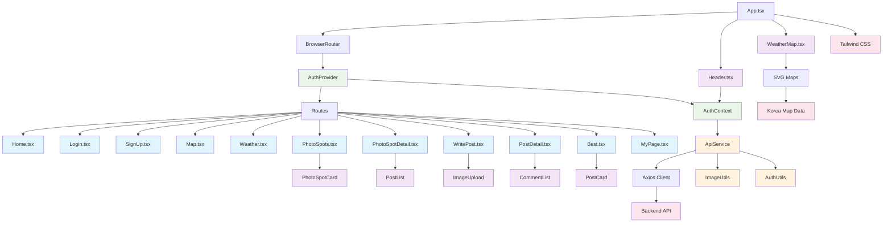

## 📱 페이지 컴포넌트 구조

### 🏠 홈페이지 (Home.tsx)
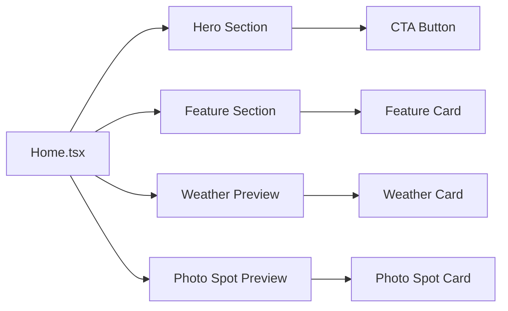

### 🗺️ 날씨 지도 (Map.tsx)
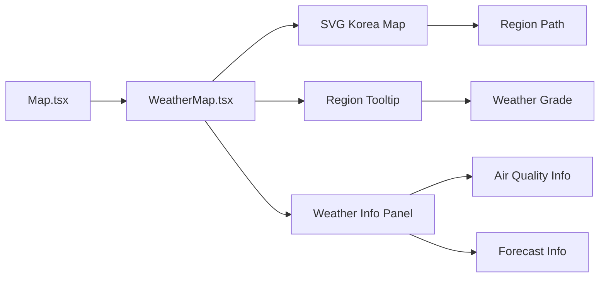

### 📍 포토스팟 목록 (PhotoSpots.tsx)
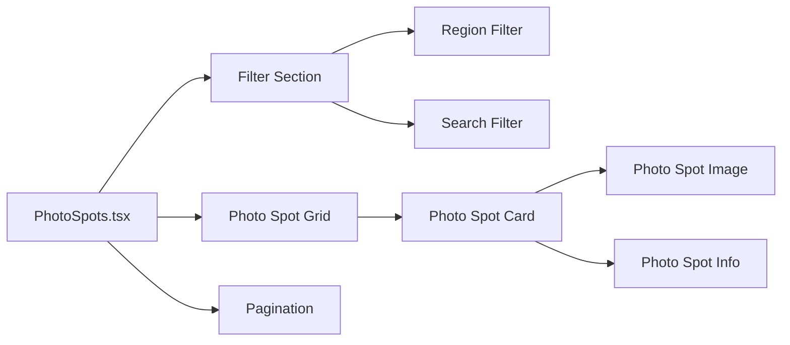

### 📝 게시글 작성 (WritePost.tsx)
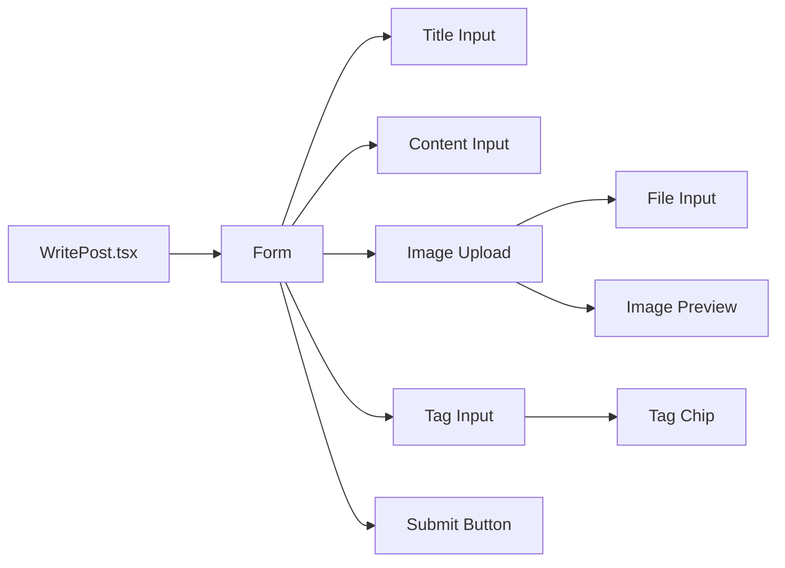

## 🔧 컴포넌트 상세 구조

### 🎯 Header 컴포넌트
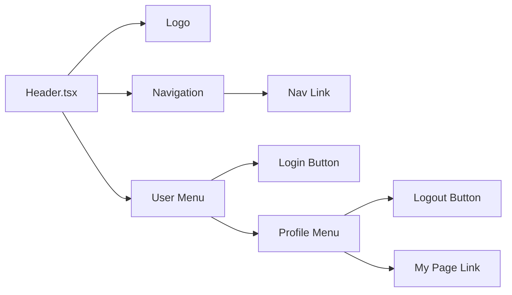

### 🌤️ WeatherMap 컴포넌트
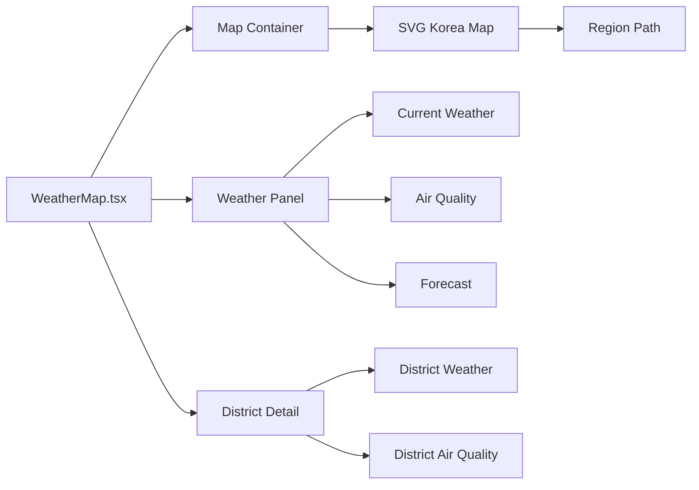

### 📊 데이터 흐름

#### 🔐 인증 플로우
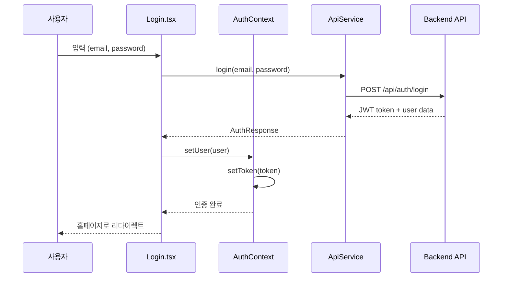

#### 📝 게시글 작성 플로우
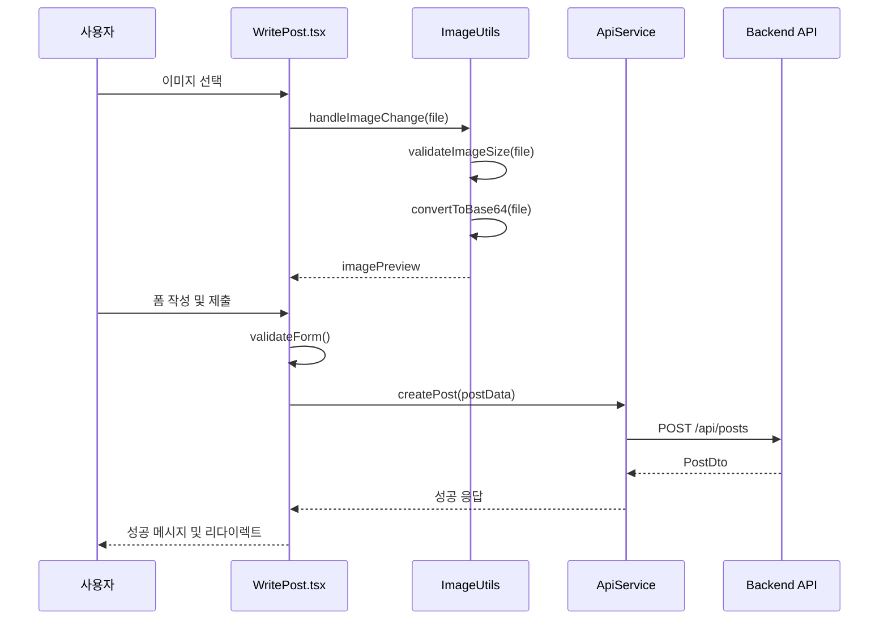

#### 🌤️ 날씨 데이터 로딩 플로우
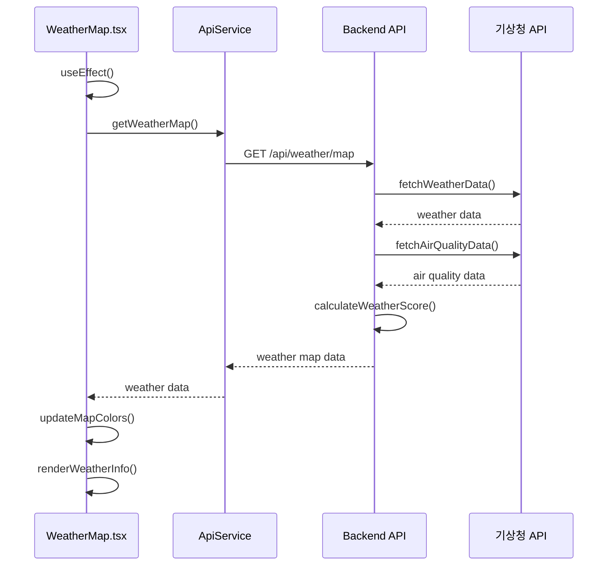

## 🎨 스타일링 구조

### 🎨 Tailwind CSS 클래스 구조
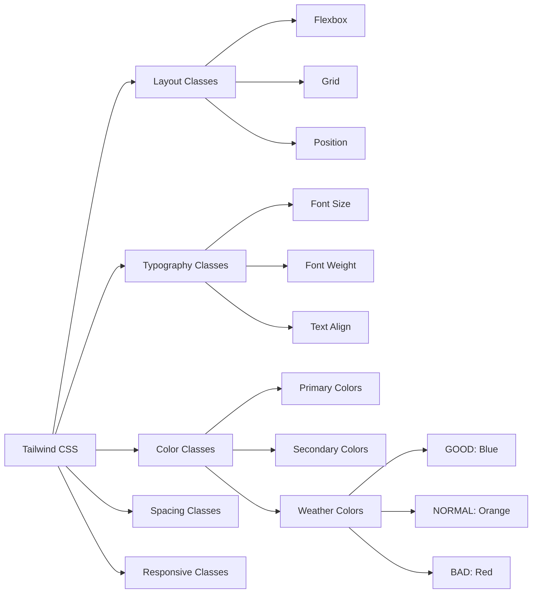

### 📱 반응형 디자인
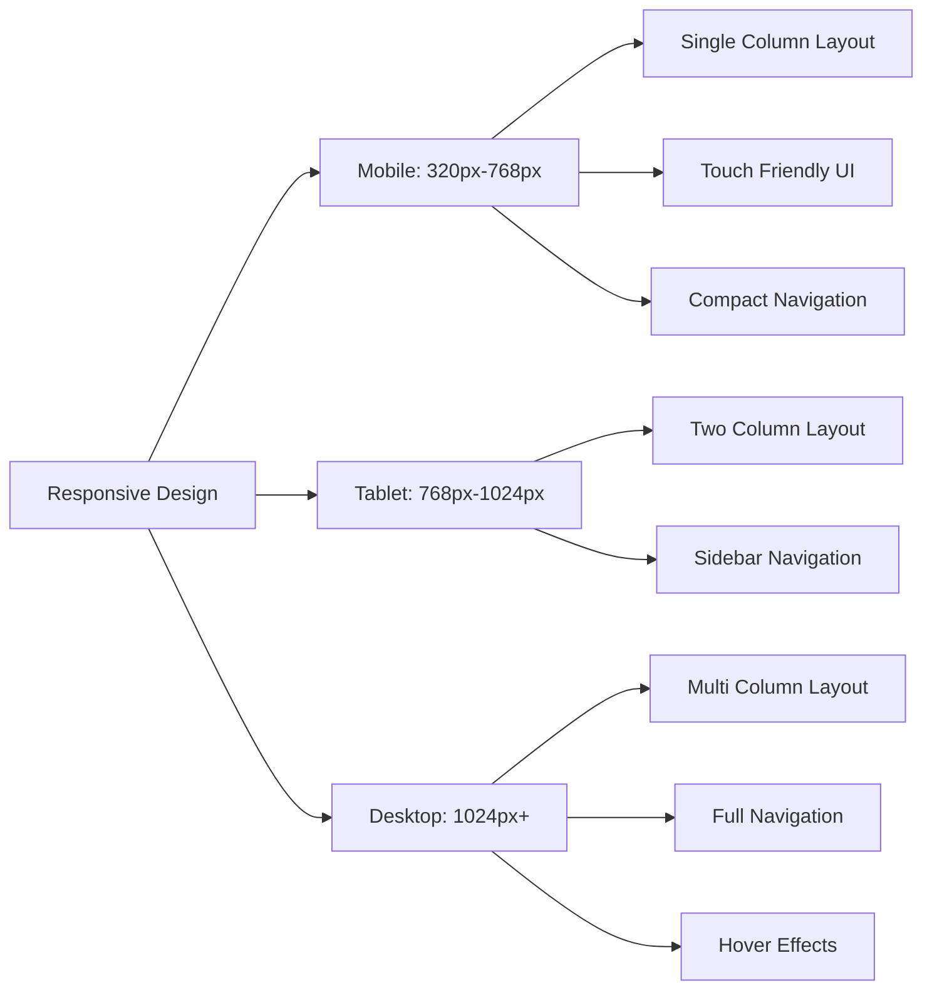

## 🔧 유틸리티 함수 구조

### 🛠️ ApiService 구조
```mermaid
graph LR
    ApiService[ApiService] --> AuthAPI[Auth API]
    ApiService --> WeatherAPI[Weather API]
    ApiService --> PhotoSpotAPI[Photo Spot API]
    ApiService --> PostAPI[Post API]
    ApiService --> CommentAPI[Comment API]
    
    AuthAPI --> Login[login()]
    AuthAPI --> Signup[signup()]
    AuthAPI --> UpdateProfile[updateProfile()]
    
    WeatherAPI --> GetWeatherMap[getWeatherMap()]
    WeatherAPI --> GetWeatherGrade[getWeatherGrade()]
    WeatherAPI --> GetDistrictWeather[getDistrictWeather()]
    
    PhotoSpotAPI --> GetAllPhotoSpots[getAllPhotoSpots()]
    PhotoSpotAPI --> GetPhotoSpot[getPhotoSpot()]
    PhotoSpotAPI --> GetPhotoSpotsByRegion[getPhotoSpotsByRegion()]
    
    PostAPI --> GetPosts[getPosts()]
    PostAPI --> CreatePost[createPost()]
    PostAPI --> ToggleLike[toggleLike()]
    
    CommentAPI --> GetComments[getComments()]
    CommentAPI --> CreateComment[createComment()]
    CommentAPI --> DeleteComment[deleteComment()]
```

### 🖼️ ImageUtils 구조
```mermaid
graph LR
    ImageUtils[ImageUtils] --> GetPhotoSpotImage[getPhotoSpotImage()]
    ImageUtils --> GetDefaultImage[getDefaultImage()]
    ImageUtils --> HandleImageError[handleImageError()]
    ImageUtils --> ValidateImageSize[validateImageSize()]
    ImageUtils --> ConvertToBase64[convertToBase64()]
    
    GetPhotoSpotImage --> ImageMapping[Image Mapping]
    ImageMapping --> GangnamStation[강남역 이미지]
    ImageMapping --> Garosugil[가로수길 이미지]
    ImageMapping --> DefaultImage[기본 이미지]
    
    ValidateImageSize --> SizeCheck[Size Check]
    SizeCheck --> MaxSize[10MB 제한]
    SizeCheck --> FormatCheck[Format Check]
    FormatCheck --> PNG[PNG 지원]
    FormatCheck --> JPG[JPG 지원]
    FormatCheck --> GIF[GIF 지원]
```

## 🎯 주요 특징

### 📱 컴포넌트 특징
- **재사용 가능한 컴포넌트**: Header, WeatherMap 등
- **페이지별 컴포넌트**: 각 라우트별 전용 컴포넌트
- **조건부 렌더링**: 인증 상태에 따른 UI 변경
- **로딩 상태 처리**: 데이터 로딩 중 스켈레톤 UI

### 🔄 상태 관리
- **Context API**: 전역 상태 관리 (AuthContext)
- **Local State**: 컴포넌트별 로컬 상태
- **Form State**: 폼 입력 상태 관리
- **Loading State**: 비동기 작업 상태 관리

### 🎨 UI/UX 특징
- **반응형 디자인**: 모바일, 태블릿, 데스크톱 지원
- **다크/라이트 모드**: 테마 지원
- **애니메이션**: 부드러운 전환 효과
- **접근성**: ARIA 라벨 및 키보드 네비게이션

### 🔧 개발 특징
- **TypeScript**: 타입 안전성 보장
- **ESLint**: 코드 품질 관리
- **Prettier**: 코드 포맷팅
- **Vite**: 빠른 개발 환경 