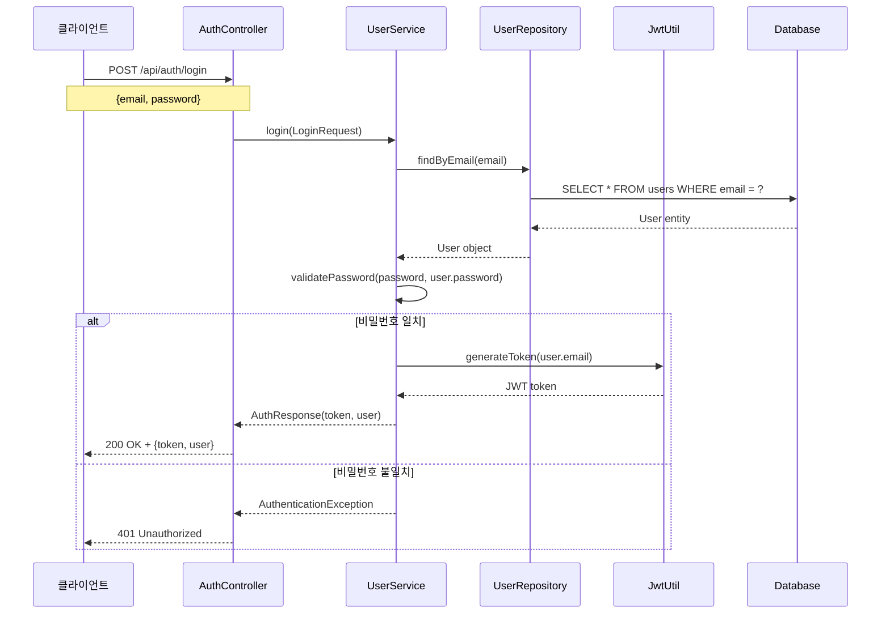
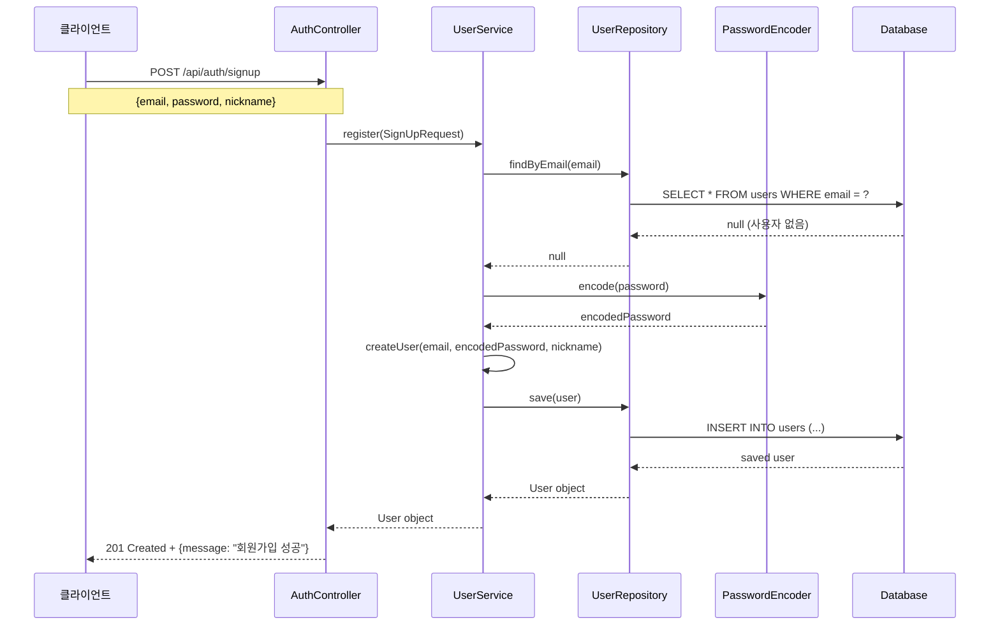
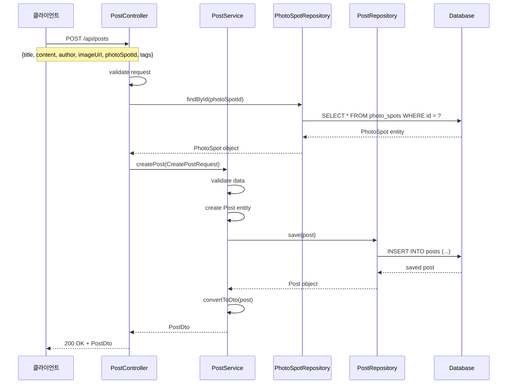
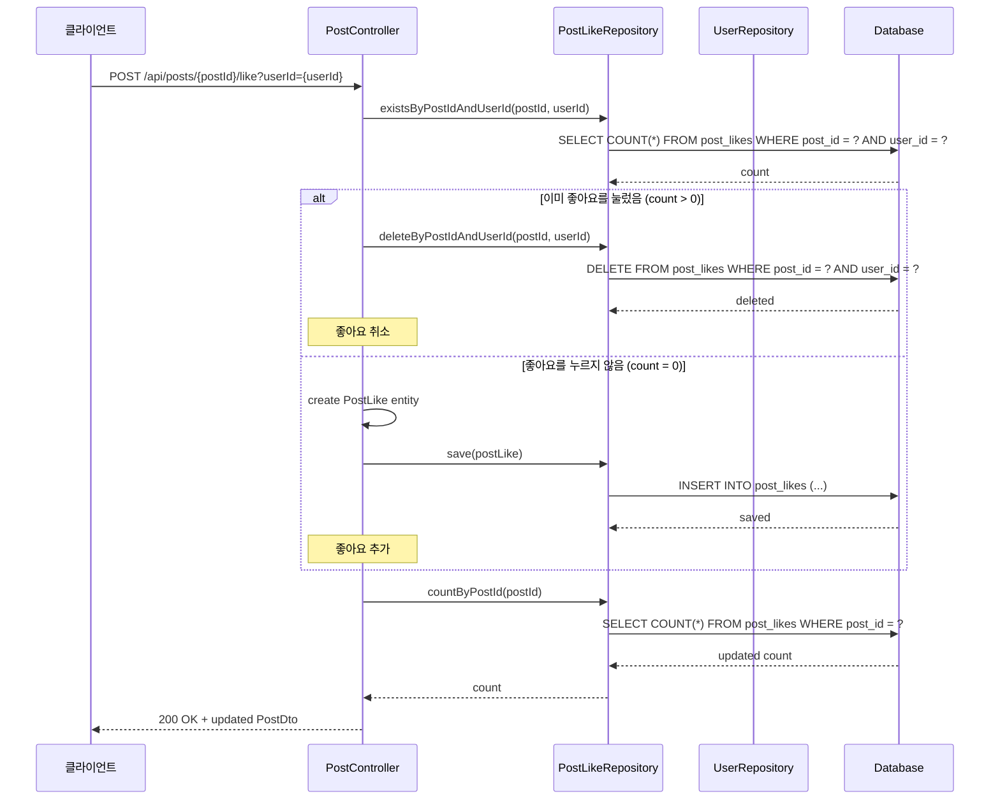
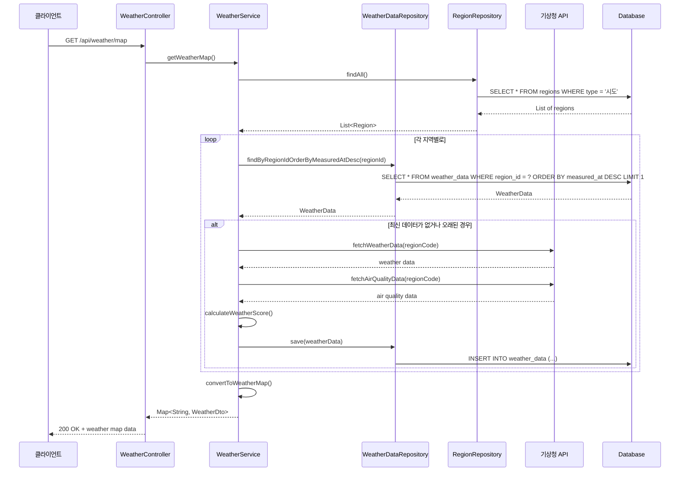
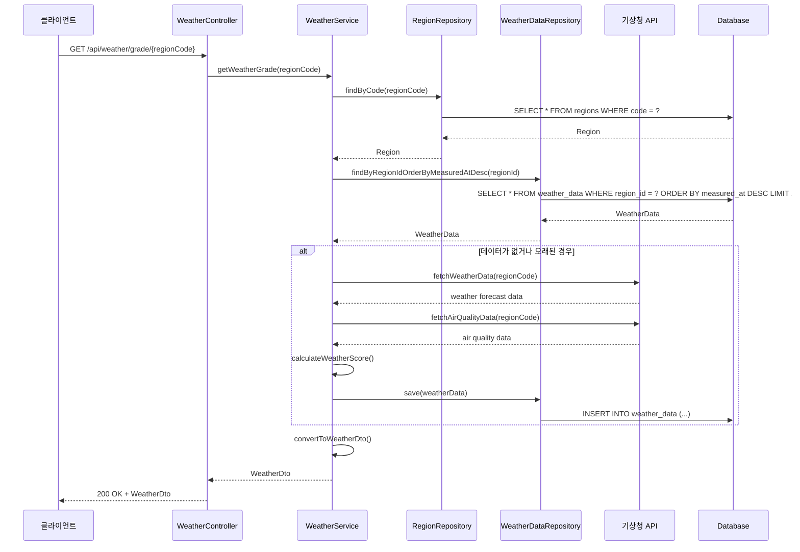
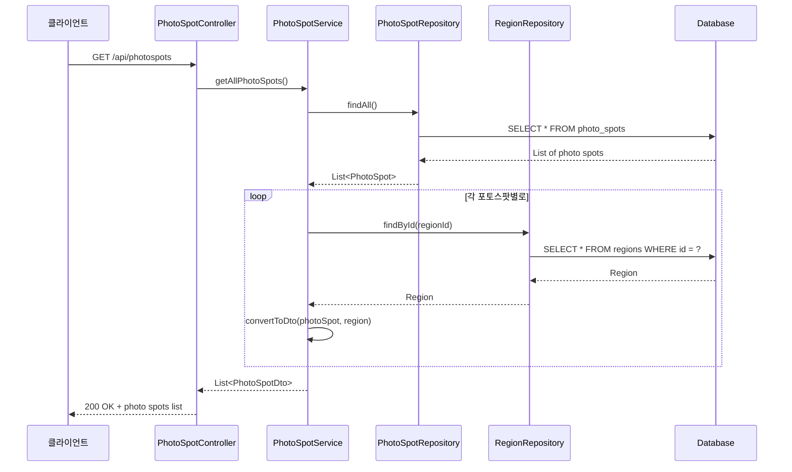
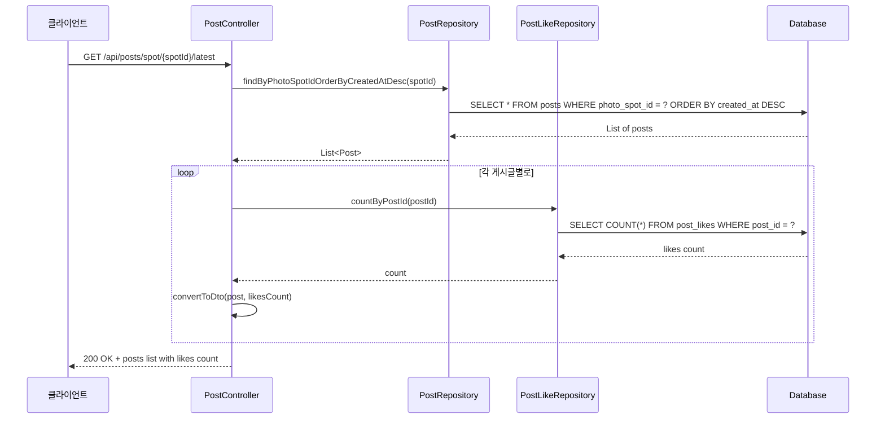
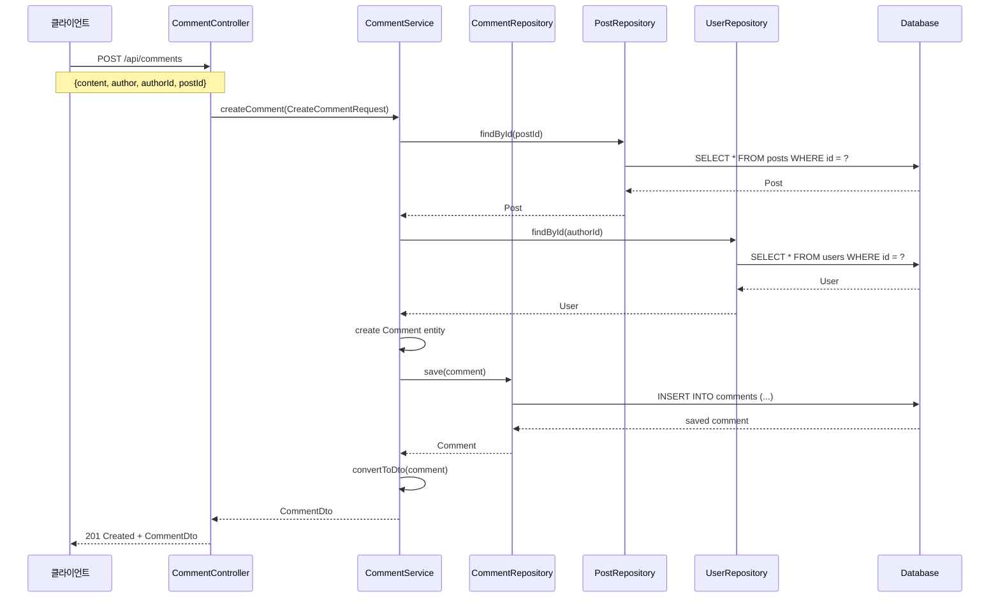
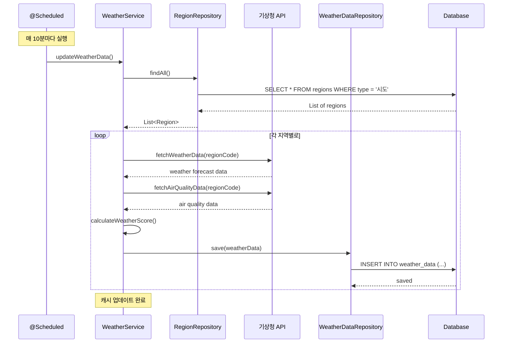

# 📊 WebForPhoto 시퀀스 다이어그램

## 🔐 사용자 인증 시퀀스

### 로그인 프로세스

### 회원가입 프로세스

## 📝 게시글 작성 시퀀스

### 게시글 생성 프로세스

### 게시글 좋아요 토글 프로세스

## 🌤️ 날씨 정보 조회 시퀀스

### 날씨 지도 데이터 조회

### 지역별 상세 날씨 조회

## 📍 포토스팟 조회 시퀀스

### 포토스팟 목록 조회

### 포토스팟별 게시글 조회

## 💬 댓글 시스템 시퀀스

### 댓글 작성

## 🔄 자동 날씨 데이터 업데이트 시퀀스

### 스케줄된 날씨 데이터 갱신

## 🎯 주요 특징

### 📊 데이터 흐름
1. **요청 처리**: Client → Controller → Service → Repository → Database
2. **응답 반환**: Database → Repository → Service → Controller → Client
3. **외부 API 연동**: Service → External API → Service
4. **자동 스케줄링**: Scheduler → Service → External API → Database

### 🔄 비동기 처리
- **날씨 데이터 갱신**: 10분마다 자동 실행
- **외부 API 호출**: 비동기 처리로 성능 최적화
- **캐싱 시스템**: 데이터베이스 캐시 활용

### 🛡️ 보안 처리
- **JWT 토큰 검증**: 모든 인증이 필요한 요청에서
- **입력 데이터 검증**: Controller 레벨에서 요청 데이터 검증
- **예외 처리**: 각 계층에서 적절한 예외 처리

### 📈 성능 최적화
- **데이터베이스 인덱싱**: 자주 조회되는 컬럼에 인덱스 적용
- **N+1 문제 해결**: JPA fetch join 활용
- **캐싱**: 날씨 데이터 캐싱으로 API 호출 최소화 