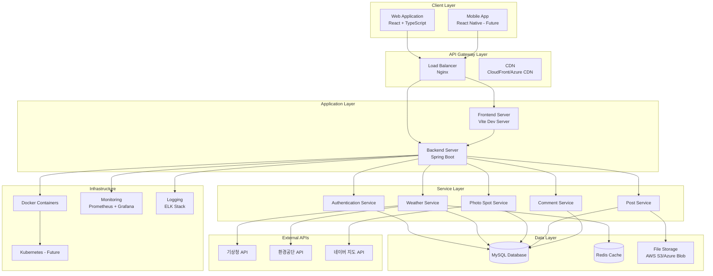
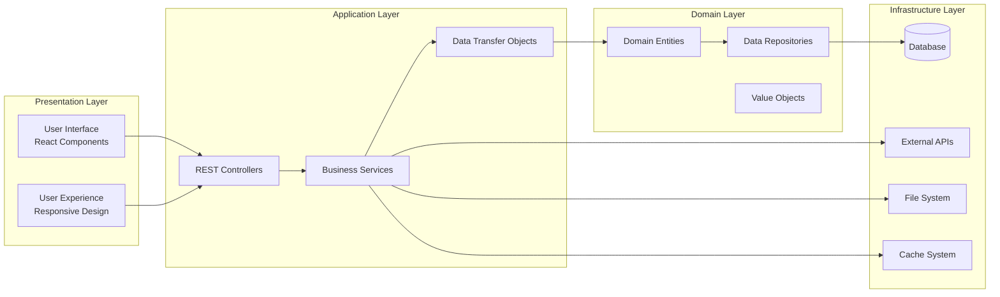
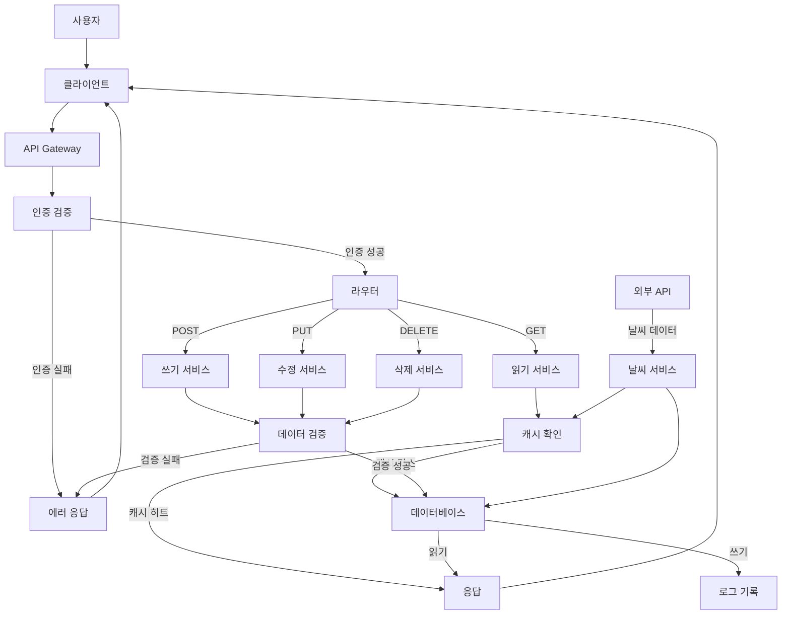
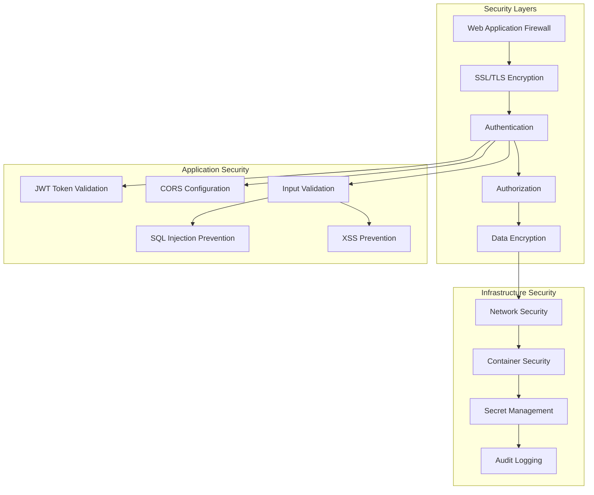
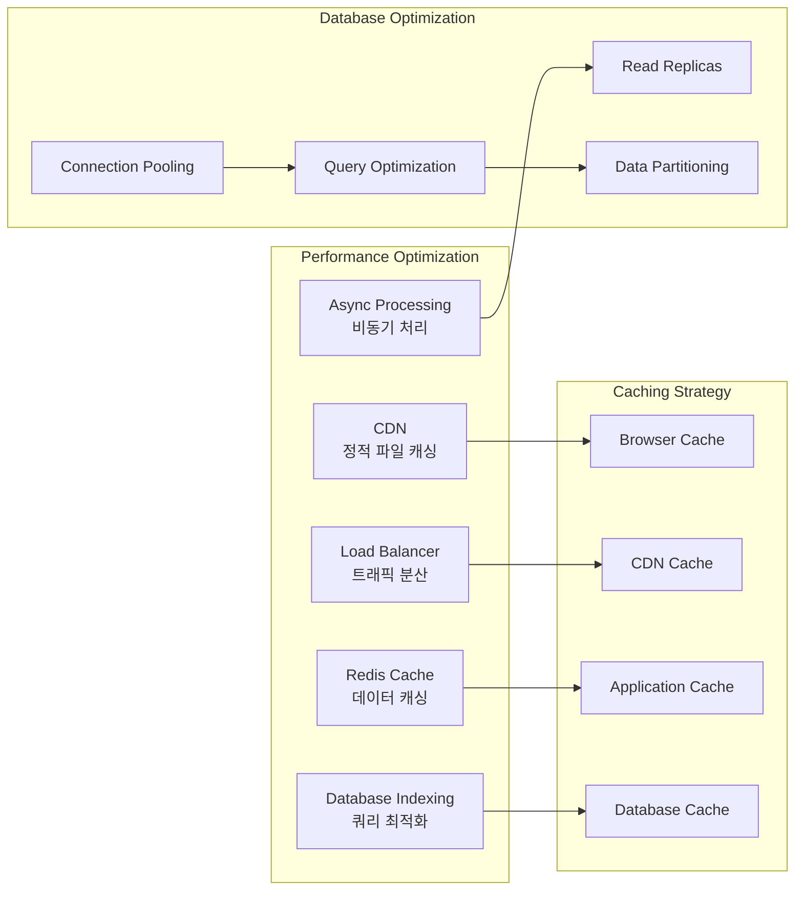
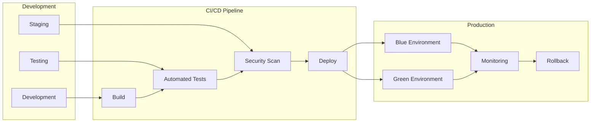
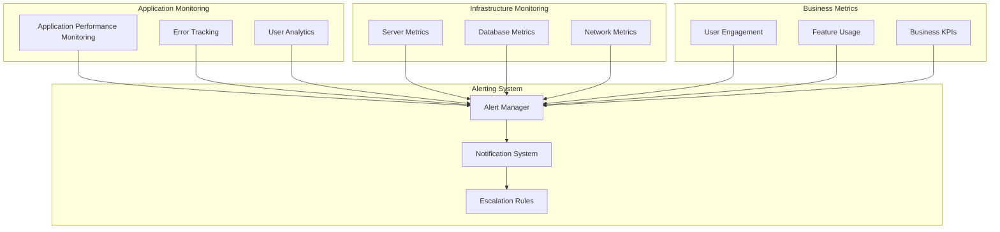
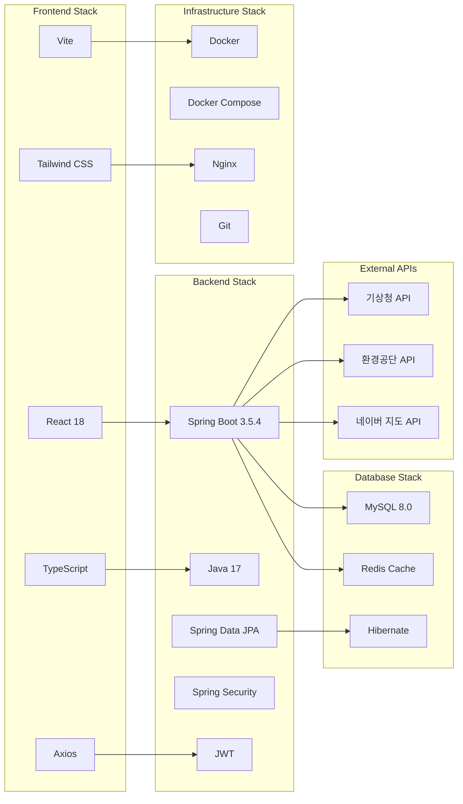

# 🏗️ WebForPhoto 전체 시스템 아키텍처

## 🌐 시스템 개요

## 🏢 시스템 아키텍처 상세

### 📊 계층별 아키텍처

## 🔄 데이터 플로우

### 📊 전체 데이터 플로우

## 🔐 보안 아키텍처

### 🛡️ 보안 계층 구조

## 📈 성능 아키텍처

### ⚡ 성능 최적화 구조

## 🔄 배포 아키텍처

### 🚀 배포 파이프라인

## 📊 모니터링 아키텍처

### 📈 모니터링 시스템

## 🔧 기술 스택 상세

### 🛠️ 기술 스택 매트릭스

## 🎯 시스템 특징

### 📊 주요 특징
- **마이크로서비스 준비**: 모듈화된 서비스 구조
- **확장 가능한 아키텍처**: 수평/수직 확장 지원
- **보안 우선**: 다층 보안 시스템
- **성능 최적화**: 캐싱 및 비동기 처리
- **모니터링 중심**: 실시간 모니터링 및 알림

### 🔄 데이터 흐름 특징
- **RESTful API**: 표준 HTTP 메서드 사용
- **JWT 인증**: 토큰 기반 인증 시스템
- **캐싱 전략**: 다층 캐싱 시스템
- **비동기 처리**: 백그라운드 작업 처리
- **외부 API 연동**: 실시간 데이터 수집

### 🛡️ 보안 특징
- **다층 보안**: WAF부터 데이터 암호화까지
- **입력 검증**: 모든 사용자 입력 검증
- **SQL 인젝션 방지**: JPA 사용으로 자동 방지
- **XSS 방지**: React의 자동 이스케이핑
- **CORS 설정**: 안전한 크로스 오리진 요청

### 📈 성능 특징
- **CDN 활용**: 정적 파일 전송 최적화
- **데이터베이스 인덱싱**: 쿼리 성능 최적화
- **연결 풀링**: 데이터베이스 연결 효율성
- **비동기 처리**: 사용자 경험 향상
- **캐싱 전략**: 응답 시간 단축 